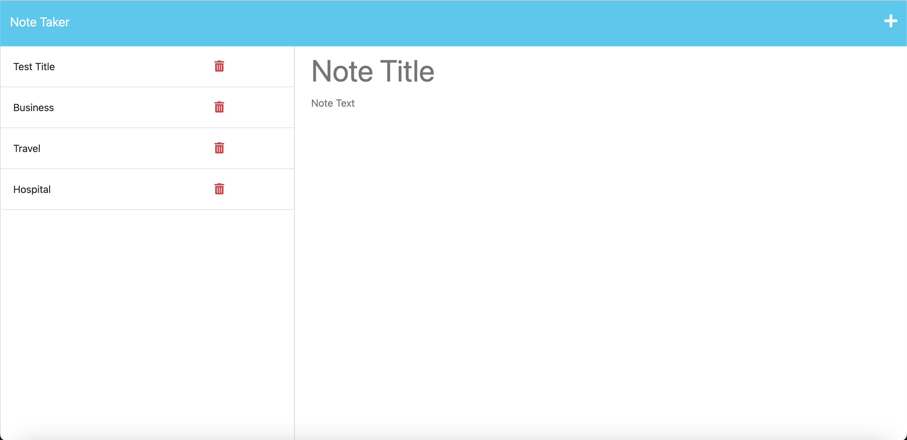

## Description

This note-taking application combines front-end and Express.js backend technologies, in order to write, save, and delete notes using note data from a JSON file. My motivation for making this application was learning how to integrate front-end and backend in the design of an application. Furthermore, I saw an opportunity to immerse myself in the complexities of server-side logic, data management, and application deployment. This application addresses the need for efficient data storage and management. Users need to trust that their notes are saved and retrieved quickly. As a result, I learned how to deploy an application to Heroku and Express.JS methods (setting up routes, middleware, and managing requests and responses) for complex application design. 

## Installation

1. Install Express.JS: `npm i express`
2. Install uuid package: `npm i uuid`
3. Install Heroku CLI for MacOS: `brew tap heroku/brew && brew install heroku`
4. Login to Heroku: `heroku login`
5. Initialize a Git Repository (if you haven't already) with
  git init
  git add .
  git commit -m "Initial commit"
`
6. Set up start script:
    "scripts": {
        "start": "node server.js"
    }

7. Commit any changes: 
    `git add .
     git commit -m "Heroku development
    `
8. Push to Heroku:`git push heroku main`
9. Open your App:`heroku open`

## Credits

THOSCALLE for inspiration: https://www.youtube.com/watch?v=-UiqzvUe360
Express.JS documentation: https://devdocs.io/express/

## Screenshot 

## Application

Heroku deployment: https://fast-forest-09400-a63b7690e4a9.herokuapp.com/